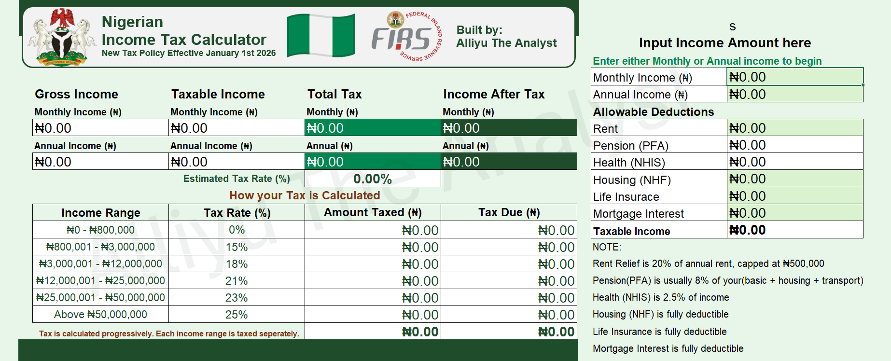
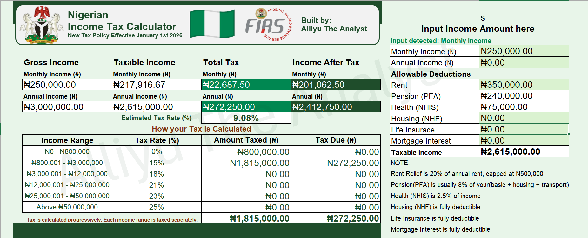

# Nigerian Personal Income Tax Calculator  Excel Tool

> An interactive, formula-driven Microsoft Excel tool for computing Nigerian Personal Income Tax (PIT) in compliance with the PAYE progressive tax bracket system - with built-in allowable deduction support.

Nigerian employees, HR teams, and accountants routinely misjudge take-home pay because PAYE tax is progressive. Each income band is taxed at its own rate, and that logic is invisible on a standard payslip. I built a fully formula-driven Excel tool (zero macros, zero VBA) that takes either monthly or annual income, applies Nigeria's 6-band PAYE structure and all PITA-recognised deductions, and returns an auditable, band-by-band tax breakdown alongside the effective tax rate. Every formula is visible in the cell, so the result isn't a black box, it's a teaching tool as much as a calculator.

### The Problem

Nigeria's PAYE system taxes income progressively across 6 bands (0% up to ₦800,000, rising to 25% above ₦50M), plus capped/percentage-based reliefs for rent, pension, NHIS, NHF, life insurance, and mortgage interest. Most people either estimate their tax with a flat-rate guess or rely on opaque payroll software. There was no simple, transparent, self-serve tool for individuals to check their own numbers.

### Data & Method

Build: pure Excel formula engine - no macros

Logic flow: Income Input → Gross Annual Income derived → Deductions applied → Taxable Income → Progressive band tax → Total Tax Due & Net Income

Key formulas: conditional monthly/annual detection (IF(Annual>0, Annual, Monthly×12)), per-band tax (MAX(0, MIN(Taxable, Ceiling) − Floor) × Rate), capped rent relief (MIN(20% × Annual Rent, ₦500,000)), auto-calculated pension (8% of gross) and NHIS (2.5% of gross)

Compliance basis: Personal Income Tax Act (PITA) as amended, current FIRS PAYE guidelines; employee-side tax only

### Interface
[Excel_Workbook](assets/Tax_Calculator.xlsx)

"Progressive taxation means no one pays their top rate on their whole income" - the tool resolves the most common misunderstanding about Nigerian tax by showing the band-by-band split explicitly.

### Allowable Deductions

The tool supports all standard PITA-recognised deductions, applied **before** tax is computed to arrive at **Taxable Income**:

| Deduction | Basis | Cap / Rule |
|---|---|---|
| **Rent Relief** | 20% of annual rent paid | Capped at ₦500,000 |
| **Pension (PFA)** | 8% of gross income | Auto-calculated |
| **Health (NHIS)** | 2.5% of gross income | Auto-calculated |
| **Housing (NHF)** | National Housing Fund contributions | Fully deductible |
| **Life Insurance** | Life insurance premiums paid | Fully deductible |
| **Mortgage Interest** | Interest on residential mortgage | Fully deductible |

> **Note:** Pension, NHIS deductions are automatically calculated from the gross income entered. Rent, NHF, Life Insurance, and Mortgage Interest require manual input of the actual amounts paid.

### Tax Band Structure

The calculator applies Nigeria's PAYE progressive tax bands as follows:

| Income Range (₦) | Tax Rate | Logic |
|---|---|---|
| ₦0 – ₦800,000 | 0% | First ₦800,000 is tax-free |
| ₦800,001 – ₦3,000,000 | 15% | Applied only to income within this band |
| ₦3,000,001 – ₦12,000,000 | 18% | Applied only to income within this band |
| ₦12,000,001 – ₦25,000,000 | 21% | Applied only to income within this band |
| ₦25,000,001 – ₦50,000,000 | 23% | Applied only to income within this band |
| Above ₦50,000,000 | 25% | Applied to all income above ₦50M |

> **Important:** Tax is calculated **progressively** - each band is taxed at its own rate, not the whole income at one rate. This is a common source of misunderstanding that this tool resolves transparently.

### How to Use

1. **Open** `Tax_Calculator.xlsx` in Microsoft Excel (2016 or later recommended) [here](https://docs.google.com/spreadsheets/d/1jPv-eAd7dQgBNd7Ic3BHBuh1m4WQ9yFt-HXyfOJG1tE/edit?usp=sharing)
2. **Enter your income** in one of two cells:
   - `Monthly Income (₦)` - if you know your monthly gross pay
   - `Annual Income (₦)` - if you know your annual gross pay
   - *(Enter only one - the other should remain 0)*
3. **Check the status prompt** - it confirms which income type was detected
4. **Enter applicable deductions** in the Allowable Deductions panel:
   - Input your **annual rent** (tool auto-calculates the capped 20% relief)
   - NHF, Life Insurance, and Mortgage Interest inputs if applicable
   - Pension and NHIS are auto-filled from your gross income
5. **Read your results** from the output summary:
   - Gross Income (Monthly & Annual)
   - Taxable Income (Monthly & Annual)
   - Total Tax Due (Monthly & Annual)
   - Income After Tax (Monthly & Annual)
   - Estimated Effective Tax Rate (%)
6. **Review the tax band breakdown table** to see exactly how your tax is sliced across each band

Link: [Google Sheets version](https://docs.google.com/spreadsheets/d/1jPv-eAd7dQgBNd7Ic3BHBuh1m4WQ9yFt-HXyfOJG1tE/edit?usp=sharing)

### Conclusion

This tool strips away the complexity of Nigerian PAYE tax computation and puts a clear, auditable, and reusable calculator in the hands of anyone who needs it. Whether you are an employee reconciling your payslip, an HR officer verifying payroll deductions, or an accountant doing quick client estimates — this calculator delivers accurate, band-by-band results with full transparency into the underlying logic.

Built entirely in Excel with zero macros, it is lightweight, portable, and immediately usable by anyone with a basic understanding of spreadsheets.

## Let's Connect
 
> Feel free to reach out: [ajagunalliyu@gmail.com](mailto:ajagunalliyu@gmail.com)  
> Connect with me on [LinkedIn](https://www.linkedin.com/in/alliyuajagun)  
> Follow on [Twitter/X](https://x.com/Sayyid_Alliyu)  
> Read more on [Medium](https://medium.com/@ajagunalliyu)  
> 💻 Explore more projects on [GitHub](https://github.com/ajagunalliyu)
> View [Portfolio website](https://sites.google.com/view/alliyutheanalyst/portfolio?authuser=0)

